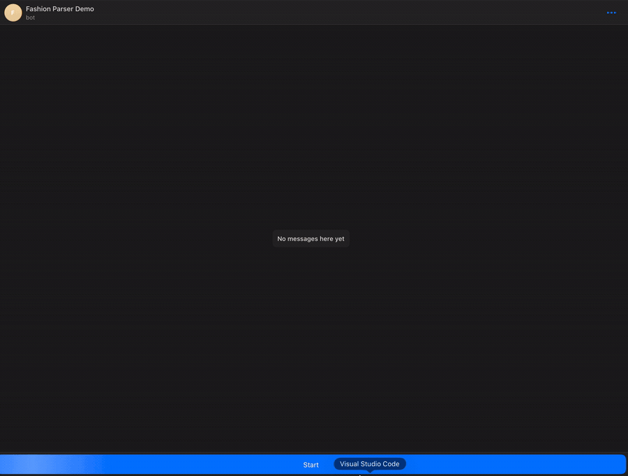

# Fashion News Parser Bot

Сервис мониторит RSS- и HTML-источники модной индустрии (Vogue, Elle, Harper's Bazaar, Buro 24/7 и др.), находит новые статьи и рассылает их подписчикам в Telegram.



## Как это работает

- **`app`** по расписанию (cron, раз в 20 минут) обходит список источников:
  - для сайтов с RSS — парсит фид напрямую (`feedparser`);
  - для сайтов без RSS — сначала пробует быстрый разбор HTML через `BeautifulSoup`, и только если результатов мало — подключает headless-браузер (`Playwright`), потому что часть сайтов рендерит контент на клиенте.
- Новые статьи (по уникальной ссылке) сохраняются в Postgres и рассылаются всем подписчикам бота.
- **`bot`** — отдельный процесс с Telegram-ботом на `aiogram`: пользователь пишет `/start`, его `chat_id` сохраняется в БД, и дальше он получает уведомления о новых статьях.

```
┌──────────┐   cron /20min   ┌────────────┐        ┌────────────┐
│  app     │ ─────────────▶  │  парсинг   │ ─────▶ │  Postgres  │
│ (парсер) │                 │ RSS / HTML │        │            │
└──────────┘                 └────────────┘        └─────┬──────┘
                                                            │
┌──────────┐        /start (chat_id)                       │
│  bot     │ ◀───────────────────────────────  Telegram ────┘
│          │ ─────────────▶  рассылка новых статей подписчикам
└──────────┘
```

## Стек

- Python 3.10, asyncio
- `aiogram` — Telegram-бот
- `feedparser`, `BeautifulSoup`, `Playwright` — парсинг RSS/HTML
- `asyncpg` — асинхронный доступ к Postgres
- `aiolimiter` — ограничение частоты рассылки в Telegram (защита от rate limit)
- Docker / Docker Compose, cron внутри контейнера
- `dbmate` — миграции БД

## Структура проекта

```
app/
  main.py            точка входа парсера
  rss_parser.py       разбор RSS-источников
  html_parser.py      разбор HTML-источников (BS4 → Playwright fallback)
  save_article.py     дедупликация статей и рассылка в Telegram
  urls.py             списки источников
  db/migrations/       SQL-миграции (dbmate)
  crontab.txt          расписание парсера
bot/
  bot.py              Telegram-бот, обработка /start
logger_config.py       общий логгер для app и bot
```

## Быстрый старт

Понадобятся Docker, Docker Compose и [dbmate](https://github.com/amacneil/dbmate) (для миграций).

```bash
cp .env.example .env
# впишите BOT_TOKEN — токен, выданный @BotFather

make build   # поднимет контейнеры и прогонит миграции
```

Остановить:

```bash
make down
```

> Миграции применяются с хоста отдельной командой (`dbmate`), а не самим контейнером `app`, поэтому при первом старте `app` может пару раз залогировать `relation "..." does not exist` до того, как миграции успеют накатиться — это ожидаемо и самоустраняется на следующем цикле cron.

## Конфигурация (`.env`)

| Переменная | Назначение |
|---|---|
| `BOT_TOKEN` | токен Telegram-бота |
| `DATABASE_URL` | строка подключения к Postgres, которую использует приложение |
| `POSTGRES_*` | параметры для инициализации контейнера с Postgres |

## Добавление источников

RSS- и HTML-адреса перечислены в `app/urls.py`. Для HTML-источника без RSS нужно дополнительно описать CSS-селекторы карточки/заголовка/ссылки в `HTML_SITE_CONFIG` в `app/html_parser.py`.

## Логи

Логи парсера и бота пишутся в `/app/app.log` внутри соответствующего контейнера:

```bash
docker compose exec app cat /app/app.log
```

## Лицензия

MIT, см. [LICENSE](LICENSE).
